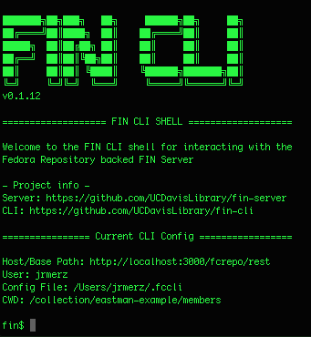

# fin-cli
CLI interface to the [fin-server](https://github.com/UCDavisLibrary/fin-server)



## Install CLI

Requires [NodeJS](https://nodejs.org/en/download/).  Then run:

```bash
npm install -g @ucd-lib/fin-cli
```
## Usage

Open a shell and type

```bash
fin shell
```

You should enter the FIN shell.  the first time you do this
you will be asked to provide your fin server url.

You can all also run fin cli commands directly from your main shell.  ex:

```bash
fin http get -P hbHB /
```
